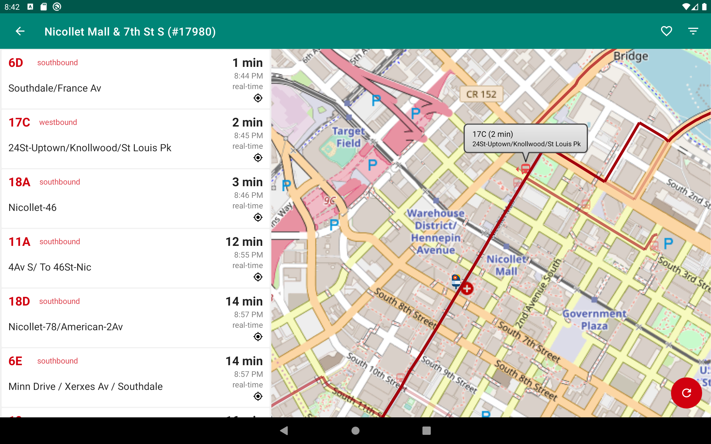

master:

next:

feature/osmdroid:

# Bus When? (Twin Cities)

Check bus arrival times in the Minneapolis–Saint Paul metro area. Enter the
Stop ID shown on your bus-stop sign to see real-time arrival estimates if
available, or scheduled arrival times if not. This is similar to the NexTrip
feature on the official [Metro Transit](https://www.metrotransit.org/) website, but we aim to do it better.

## How to build

See developer.android.com for tutorials on how to build Android apps.

https://developer.android.com/training/basics/first

## License

Copyright (C) 2019 Sweetie Piggy Apps <sweetiepiggyapps@gmail.com>

Bus When? (Twin Cities) is free software; you can redistribute it and/or modify
it under the terms of the GNU General Public License as published by
the Free Software Foundation; either version 3 of the License, or
(at your option) any later version.

Bus When? (Twin Cities) is distributed in the hope that it will be useful,
but WITHOUT ANY WARRANTY; without even the implied warranty of
MERCHANTABILITY or FITNESS FOR A PARTICULAR PURPOSE. See [COPYING](COPYING) for more details.

### Additional permission under GNU GPL version 3 section 7

If you modify this Bus When? (Twin Cities), or any covered work, by linking or
combining it with Google Play services (or a modified version of that
library), containing parts covered by the terms of the respective licensing
agreement, the licensors of Bus When? (Twin Cities) grant you additional
permission to convey the resulting work.

### Attribution and Trademarks

See [Attribution.md](Attribution.md)

